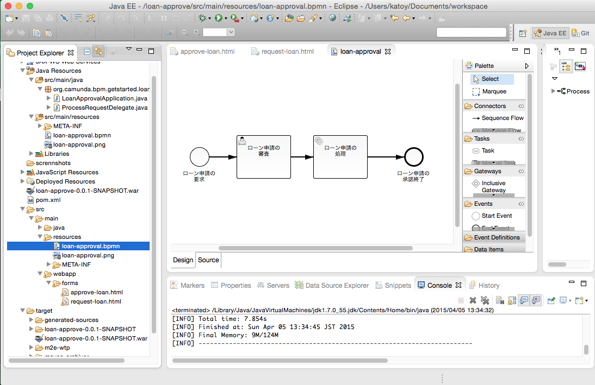
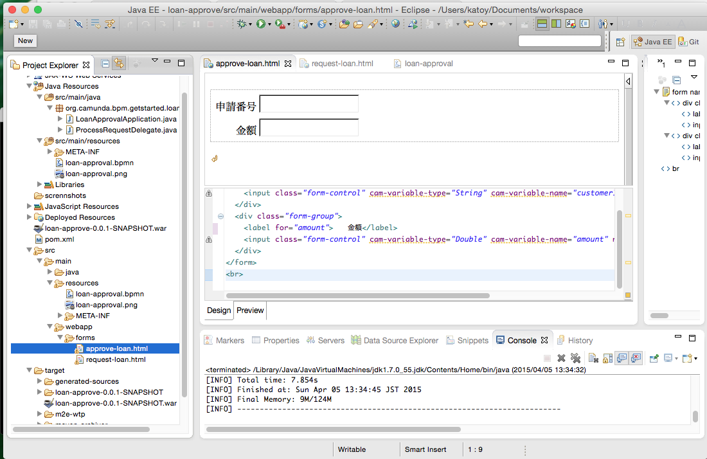
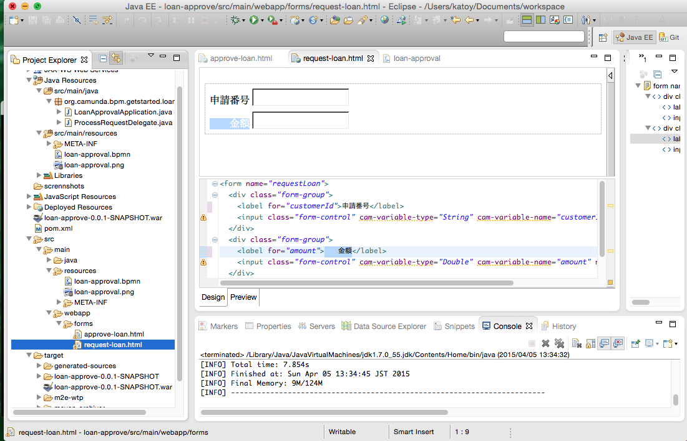
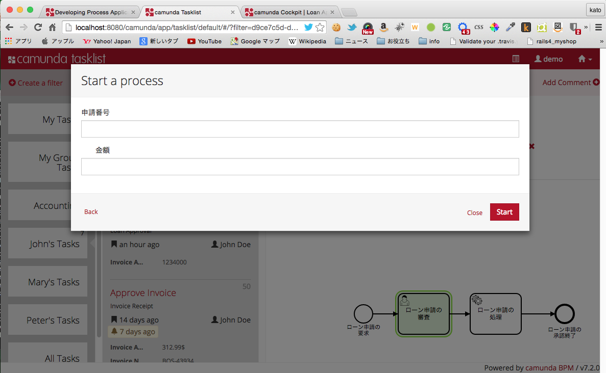
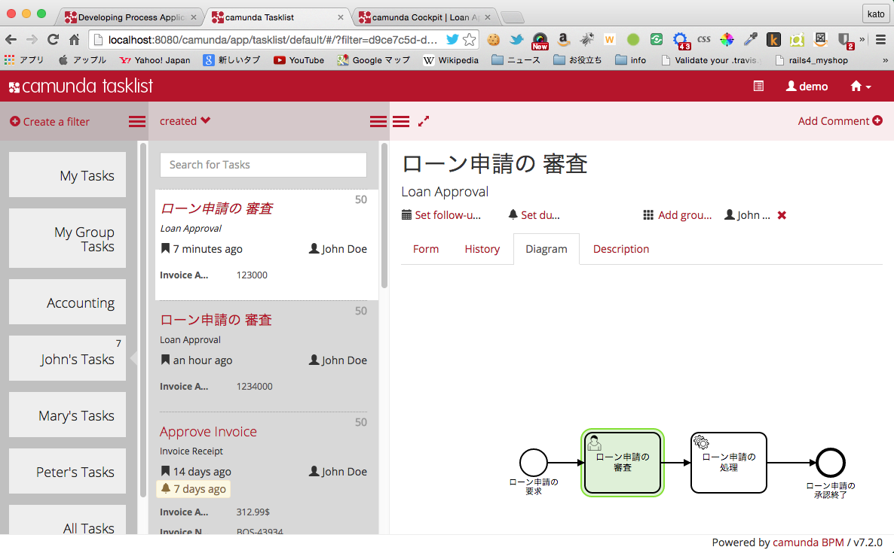

# BPMN エンジン camunda のサンプルを日本語化

BPMN 2.0プロセスエンジン の一つに [camunda](https://camunda.com/) があります。  
その[チュートリアル](http://docs.camunda.org/latest/guides/getting-started-guides/developing-process-applications/) をなぞるとともに、少しだけ日本語化してみました。

## 環境
- MacOSX 10.2.2
- eclipse Kepler Service Release 2
- Apache Tomcat/7.0.5  [camunda-bpm-tomcat-7.2.0.tar.gz](http://camunda.org/release/camunda-bpm/tomcat/)
- Java SE 7 (1.7.0_55)
- Apache Maven 3.3.1

## スクリーンショット
eclipse 上での編集中の様子

アプリケーションを動作させている時の様子

eclipse 中での java の設定を 1.6 以上にしないと、maven で install した
したときに dynamic web 設定についてのエラーが出ます。
作業上では このエラーの解消に手こずりました。
(私の環境では、default 状態では java 1.5 の設定になってました)

See  [http://stackoverflow.com/questions/23183931](http://stackoverflow.com/questions/23183931/maven-java-ee-configuration)

camunda についての情報は、日本語のものは少ないです。
すこしでも参考になれば幸いです。
